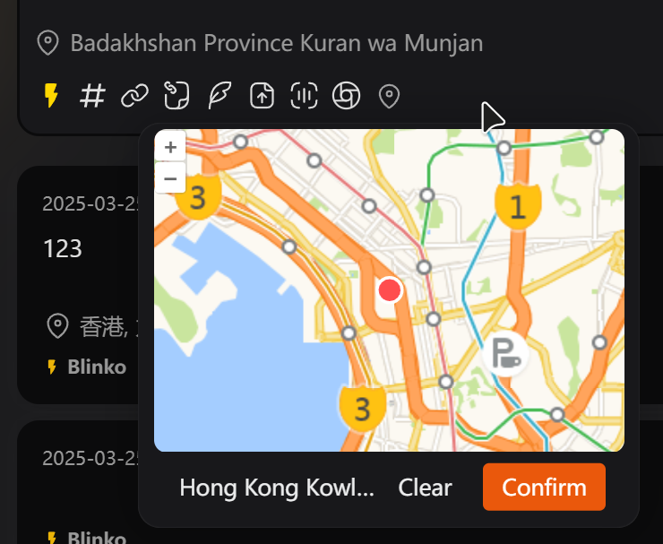

# Blinko Map Location Plugin

A plugin for Blinko that allows users to attach location information to their notes.



## Features

- Search and select locations on a map
- Automatically fetch current user location
- Reverse geocoding to get readable location names
- Attach location metadata to notes
- Display location information in the note footer
- Click on location to view or update it

## Installation

1. Install dependencies:
```bash
npm install
```

2. Start the development server:
```bash
npm run dev
```

## Usage

1. Create or open a note in Blinko
2. Click the location icon in the toolbar
3. Select a location on the map or use your current location
4. Click "Confirm" to attach the location to your note
5. The location will appear in the note footer

To update or remove a location:
- Click on the location displayed in the note footer
- Select a new location or click "Clear" to remove it
- Click "Confirm" to save your changes

## Technical Details

This plugin uses:
- OpenLayers for map rendering
- Gaode Map tiles for map data
- OpenStreetMap's Nominatim service for reverse geocoding
- Preact for UI components

## Development

To build the plugin for production:
```bash
npm run release:publish
```

## License

[MIT](LICENSE)
